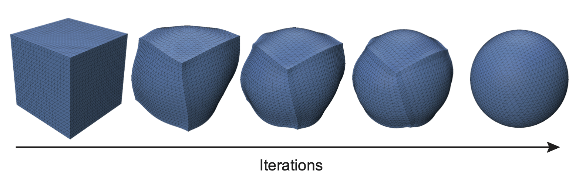

### The mini Surface Evolver

**The mini Surface Evolver** is a PyTorch-based minimalist implementation of area-minimization on manifolds, inspired by [The Surface Evolver](https://en.wikipedia.org/wiki/Surface_Evolver), under 120 lines of code.

We propose two versions, one from a single closed manifold, and one that manages several cells. 

### Features: 

- Computation of derivatives of the energy with automatic differentiation
- Projection-based Volume conservation
- GPU compatibility
- Mesh-viewer with Polyscope
- No remeshing, collision detection or topology transitions

We rely on [largesteps](https://github.com/rgl-epfl/large-steps-pytorch) to regularise the gradient descent, allowing to maintain a good mesh quality during the optimization.

### How to run

Single cell version: 
`git clone https://github.com/sacha-ichbiah/mini-surface-evolver && cd mini_surface_evolver && python -m pip install -r requirements.txt && python main_manifold.py`

### Physical model
With several cell, we minimize, under conservation of volume, the energy $\mathcal{E} = \underset{ij}{\sum}\gamma_{ij}A_{ij}$, where $\gamma_{ij}$ are the surface tensions of the interface between the cells $i$ and $j$ and $A_{ij}$ the associated area. 

The two physical laws that are consequence of this model are: 
- **Young-Dupré Law:** $\gamma_{ij} + \gamma_{ik} + \gamma_{jk} = 0$
- **Laplace Law:** $P_j - P_i = 2 \gamma_{ij} h_{ij}$ where $h_{ij}$ is the mean curvature of the interface between the cell i and j. `

**The mini Surface Evolver** was created by Sacha Ichbiah during his PhD in [Turlier Lab](https://www.turlierlab.com), to provide a simple and understandable energy minimization method on python.
